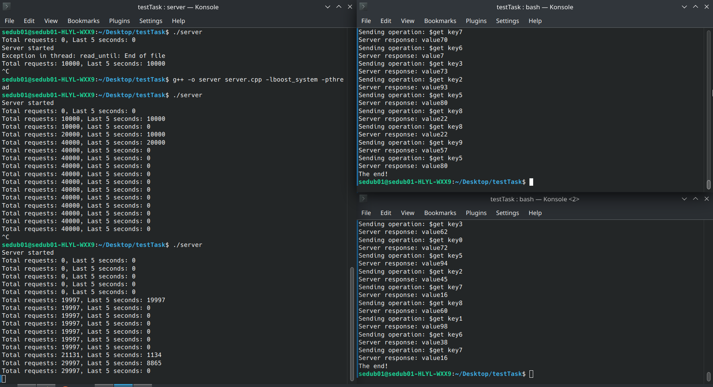

# gaijin

Example below. Server and two clients were running at the same time 

I decided to use random keys to make the example more versatile and dynamic. This approach allows to demonstrate the client's work with any data, without need to edit the code when changing the list of keys.
